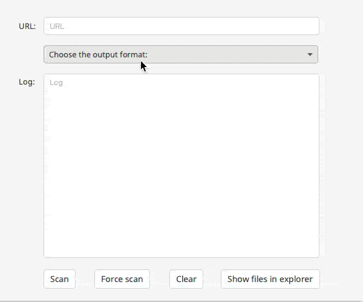

# WhatWebGUI


WhatWebGUI is a cross-platform compatible Java-based application for Windows 10, Mac OSX and Linux which implements the front end of the popular web scanning tool WhatWeb, the next generation web scanner, and provides it with a fresh-looking UI with some interesting features.

## Functionalities

### CMS and server scan
In these tabs, which are interconnected (a search in one of the tabs will appear in both), you will be able to scan both the CMS (Content Management System) and the server of a website. 


You can also filter by website, date or Server / CMS type and fav any website so it's easier for you to find it!


### Formatter
If you want to get the scan in any format WhatWeb provides, you can do it from here. Furthermore, as these scans are saved in cache, you will be able to access any file you want with a button that opens the file explorer in this cache folder.



### Scan history
You will be able to track all of your scans from the History tab. What, where and when!

### Multi-add

Do you have a loooong file with links in it and want to scan it? Ask no more, we got you covered! The scanned websites will appear in the CMS and Server tabs.


### Share option

For those who like to share it all, there's also an option to share those scans on Twitter, Facebook, Reddit or Tumblr. 


### Wrong URL

If you type the URL and the program can't connect to it, an alert will appear.


## Installation
### Linux & Mac
It's pretty easy to install WhatWebGUI with a \*nix system. Just download the version that suits your OS and your desires (whether you prefer it installed or in a folder), install WhatWeb from the package manager, open it and you're ready to scan any website!
> NOTE: We recommend to run the following command to install WhatWeb:
```
sudo apt-get update && sudo apt-get upgrade && sudo apt install whatweb
```
> NOTE2: In Linux, Java 15 must be installed. In Mac, Java 11 is enough. 

### Windows 10
The installation is tougher in Windows.  First of all, the WSL (Windows Subsystem for Linux) needs to be installed, as WhatWeb is not available for the OS developed by Microsoft. To install it, there's [an official tutorial](https://docs.microsoft.com/en-us/windows/wsl/install-win10). However, we decided to prepare some scripts so the installation would require just two clicks for you. The steps are the following:
1. Download [the zip containing all of the scripts](files/WSL.zip).
2. Extract it (no matter where).
3. Run **installwsl.bat**
4. Restart the computer.
5. Run **installubuntu.bat** or **installdebian.bat**. Choose whichever you want. We recommend Debian because it's lighter.
6. Open the Linux distro you chose from the Start Menu 
7. Create a user and once you're in type the following command:
```
sudo apt-get update && sudo apt-get upgrade && sudo apt install whatweb
```
Install the application, open it and now you're ready to scan any website!
> NOTE: Java 11 must be installed. 

## Usage
The usage is very intuitive. There's a search bar where you have to type the website you want to scan. Then, press enter or click the Scan button and it will scan the website!

To make things easier, a tutorial is displayed the first time the program is executed. However, this tutorial can be visited again from the Settings tab.

## Documentation
The documentation for the project is available [in the following link](files/WhatWebGUI_DOCUMENTATION.pdf). It is in Basque, so you may prefer talking to us instead ;)
